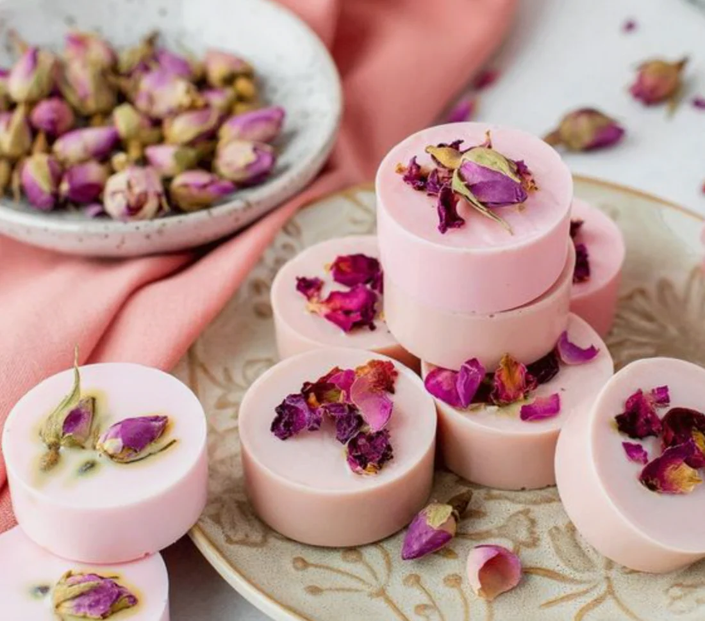
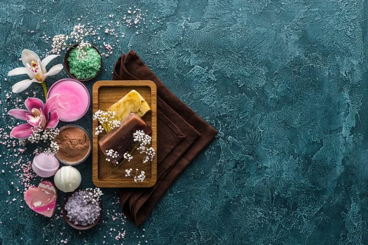
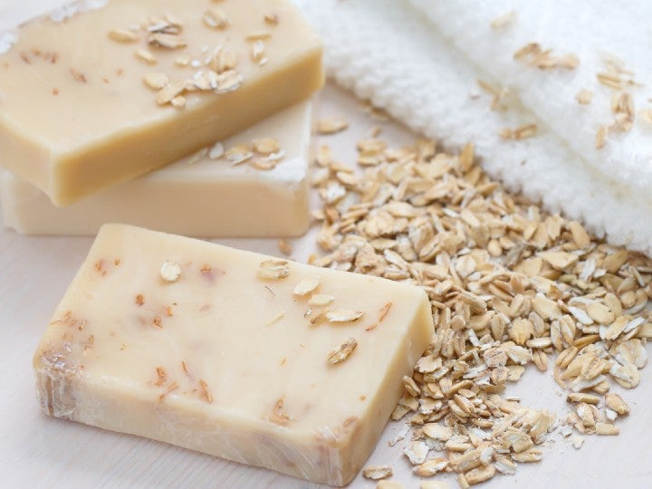
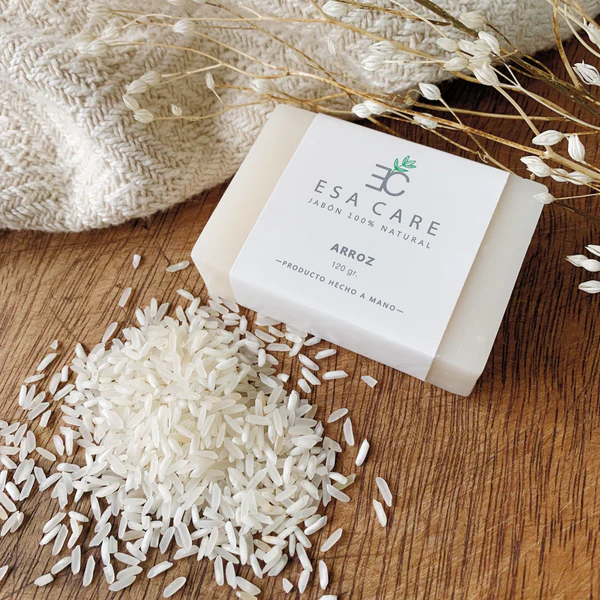
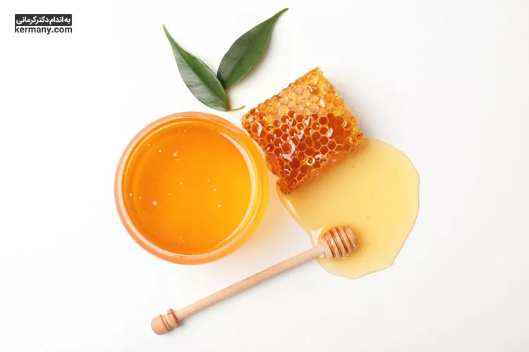

<!DOCTYPE html>
<html lang="es">   

<head>
  <meta charset="UTF-8" />
  <meta name="viewport" content="width=device-width, initial-scale=1.0" />
  <title>DermoZen - Mi Emprendimiento</title>

  <link href="https://fonts.googleapis.com/css2?family=Poppins:wght@300;600&display=swap" rel="stylesheet" />

  
</head>

<body>

  

    <h1>DermoZen - Lo que Mereces en tú vida</h1>
  

  

    <a href="#" onclick="irAInicio()">Inicio</a>
    <a href="#mision">Misión</a>
    <a href="#vision">Visión</a>
    <a href="#productos">Productos</a>
    <a href="#pedido">Pedido</a>
    <a href="#registros">Registros</a>
  

  

    

      <h2>¿Por qué usar jabones naturales?</h2>
      
Porque cuidan tu piel sin químicos agresivos, son biodegradables y amigables con el medio ambiente. Ideales para toda la familia.

    

    

      <h2>Beneficios de nuestros jabones</h2>
      
Hidratación profunda, suavidad, propiedades antibacterianas y aroma natural. Cada jabón está hecho con dedicación y calidad artesanal.

    

    

      <h2>Ingredientes que usamos</h2>
      
Aceite de coco, miel, avena, lavanda, aloe vera y otros ingredientes 100% naturales seleccionados cuidadosamente.

    

  

  <section id="mision">
    <h2>Nuestra Misión</h2>
    
Ofrecer jabones naturales artesanales de alta calidad que promuevan el cuidado personal y la conciencia ecológica, utilizando ingredientes sostenibles y procesos responsables.

  </section>

  <section id="vision">
    <h2>Nuestra Visión</h2>
    
Convertirnos en una marca reconocida a nivel nacional por brindar bienestar, salud y respeto por el medio ambiente a través de nuestros productos naturales.

  </section>

  <!-- Carrusel de imágenes -->
  <section aria-label="Carrusel de productos naturales">
    

      

        
        
        
        
        
        <!-- Duplicado para loop -->
        
        
        
        
        
      

    

  </section>
  <section id="testimonios">
  <h2>Lo que Dicen Nuestros Clientes</h2>
  

    

      
"Desde que uso el jabón de avena, mi piel se siente más suave y menos irritada. ¡Recomiendo DermoZen al 100%!"

      
<strong>- María, Santa Ana</strong>

    

    

      
"Mi favorito es el de miel. Me encanta su aroma y cómo deja mi piel hidratada."

      
<strong>- José, San Salvador</strong>

    

    

      
"Probé el de aloe vera y me ayudó con la resequedad. ¡Gracias por crear productos naturales y efectivos!"

      
<strong>- Carmen, Ahuachapán</strong>

    

  

</section>

  <!-- Video tutorial -->
  <section id="video">
    <h2>Empresas industriales</h2>
    

      <iframe src="https://www.youtube.com/embed/2KXKeyh-Uwc?si=c8oV3bHlrj1iqboy" title="YouTube video player" allow="accelerometer; autoplay; clipboard-write; encrypted-media; gyroscope; picture-in-picture; web-share" allowfullscreen></iframe>
    

    

  <a href="https://www.youtube.com/results?search_query=jabones+artesanales" target="_blank" style="background-color: #27ae60; color: white; padding: 12px 25px; border-radius: 8px; text-decoration: none; font-weight: bold; transition: background-color 0.3s ease;">
    Ver más sitios
  </a>

  </section>
  

  <!-- GALERÍA DE PRODUCTOS -->
  <section id="productos">
    <h2>Nuestros Productos</h2>
    

      

        
        <h3>Jabón de Avena</h3>
        
Exfolia suavemente tu piel y calma la irritación.

        
$1.00

      

      

        
        <h3>Jabón de Arroz</h3>
        
Ideal para limpiar profundamente y suavizar la piel.

        
$1.00

      

      

        
        <h3>Jabón de Aloe Vera</h3>
        
Hidratación profunda para pieles sensibles.

        
$1.00

      

      

        
        <h3>Jabón de Miel</h3>
        
Nutre tu piel y tiene propiedades antibacterianas.

        
$1.00

      

    

  </section>
<section id="video">
  <h2>Empresas Industriales</h2>
  

    <iframe width="560" height="315" src="https://www.youtube.com/embed/wTdHmbRw-W8?si=EsnrmnW-JfsWkfeq" title="YouTube video player" frameborder="0" allow="accelerometer; autoplay; clipboard-write; encrypted-media; gyroscope; picture-in-picture; web-share" referrerpolicy="strict-origin-when-cross-origin" allowfullscreen></iframe>
  

</section>
<section id="precios">
  <h2 style="text-align: center; color: #5c95f1;">Paquetes Promocionales</h2>

  

  

    

      

        
      

      <h3>Combo Básico</h3>
      
3 jabones surtidos para el cuidado diario.

      
$2.50

    

    

      

        
      

      <h3>Combo Familiar</h3>
      
6 jabones a tu elección. Ideal para la familia.

      
$5.00

    

    

      

        
      

      <h3>Paquete Mayorista</h3>
      
12 jabones con descuento para revender o regalar.

      
$9.00

    

  

</section>
<!-- FORMULARIO DE PEDIDO / CONTACTO -->
<section id="pedido">
  <form class="contact-form" onsubmit="return enviarFormulario(event)">
    <h2>Haz tu Pedido o Contáctanos</h2>

    <label for="nombre">Nombre completo:</label>
    <input type="text" id="nombre" name="nombre" required placeholder="Tu nombre completo" />

    <label for="correo">Correo electrónico:</label>
    <input type="email" id="correo" name="correo" required placeholder="ejemplo@correo.com" />

    <label for="telefono">Teléfono (opcional):</label>
    <input type="tel" id="telefono" name="telefono" placeholder="Tu número de teléfono" />

    <label for="tipoJabon">Tipo de jabón:</label>
    <select id="tipoJabon" name="tipoJabon" required>
      <option value="">-- Selecciona un jabón --</option>
      <option value="Avena">Jabón de Avena</option>
      <option value="Arroz">Jabón de Arroz</option>
      <option value="Aloe Vera">Jabón de Savila</option>
      <option value="Miel">Jabón de Miel</option>
    </select>

    <label for="cantidad">Cantidad:</label>
    <input type="number" id="cantidad" name="cantidad" min="1" required placeholder="Cantidad de jabones" />

    <label for="direccion">Dirección de envío:</label>
    <textarea id="direccion" name="direccion" rows="3" placeholder="Escribe tu dirección completa"></textarea>

    <button type="submit">Enviar pedido</button>
  </form>
</section>
<!-- Reproductores de audio estilizados -->

  

    <audio controls>
      <source src="images/traimory-mega-horn-angry-siren-f-cinematic-trailer-sound-effects-193408.mp3" type="audio/mp3">
      Tu navegador no soporta audio HTML5.
    </audio>
  

  

    <audio controls>
      <source src="images/Audio de WhatsApp 2025-07-02 a las 16.32.19_d7e95bcf.waptt.opus" type="audio/mp3">
      Tu navegador no soporta audio HTML5.
    </audio>
  

